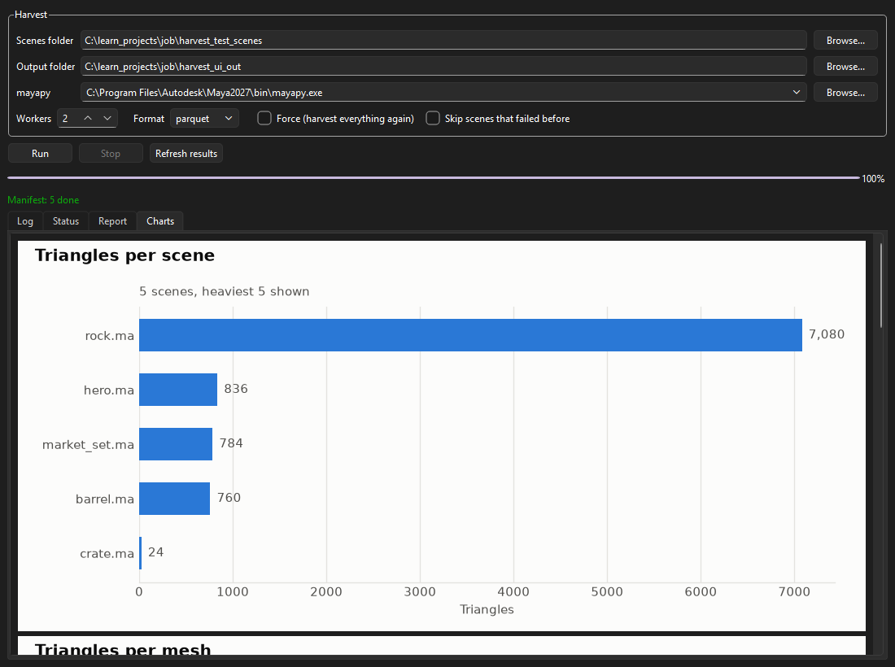
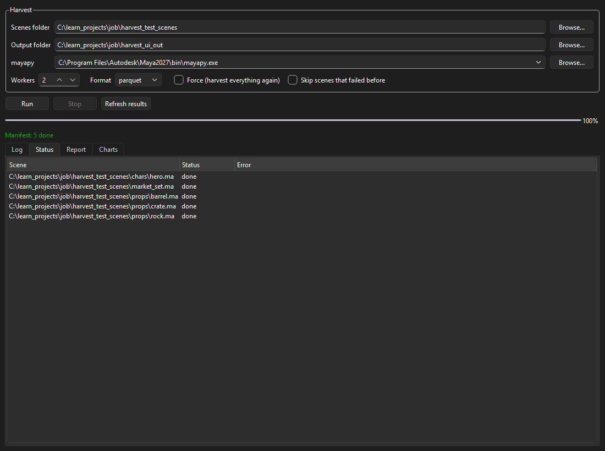
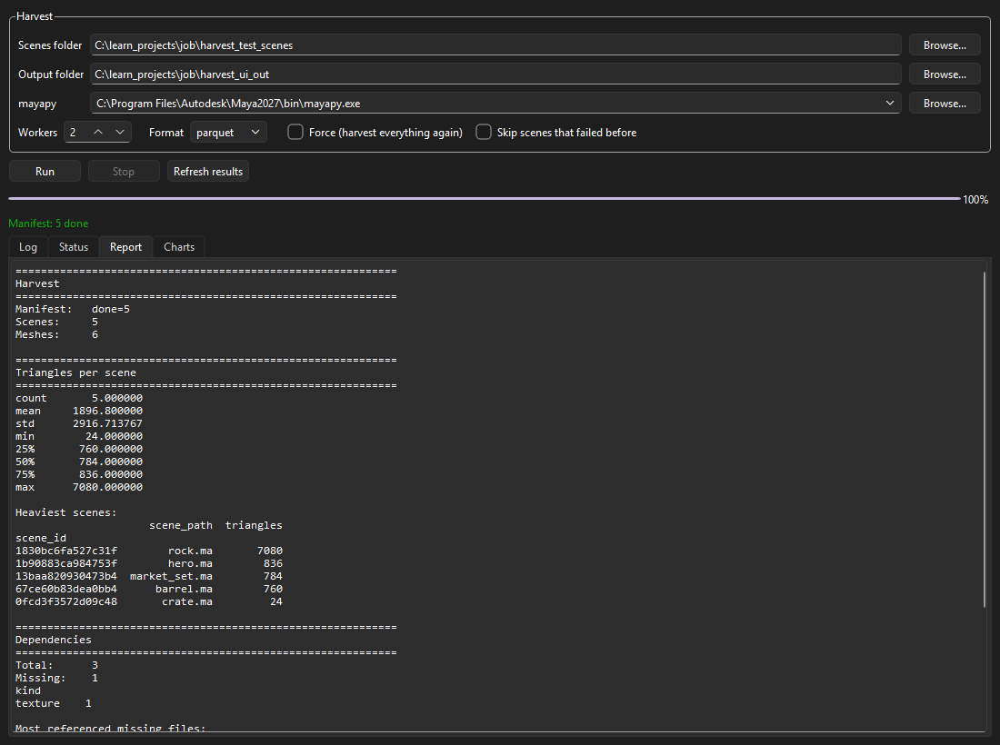
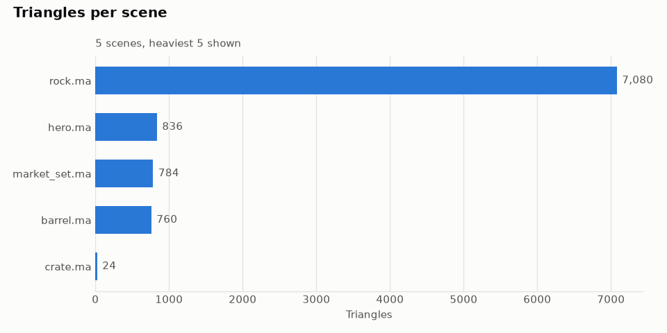
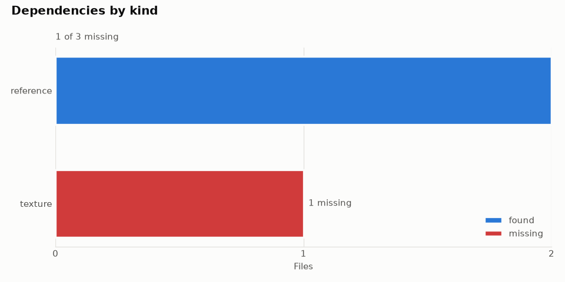
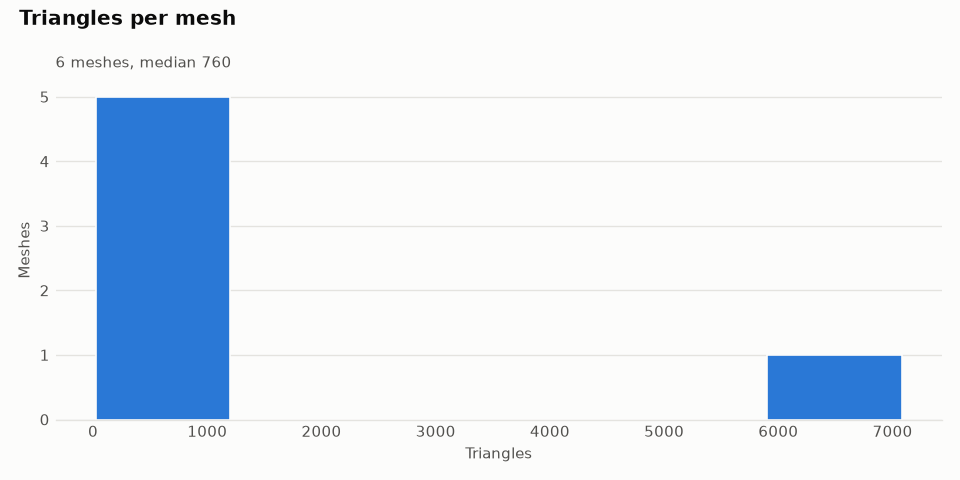
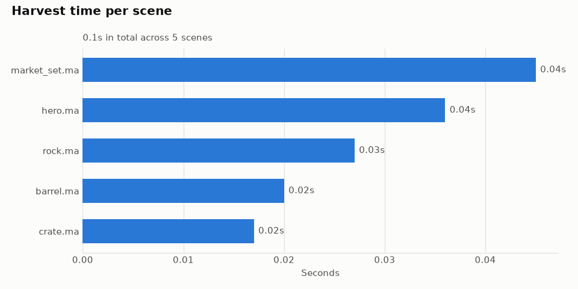

# scene_harvest

Point it at a folder of Maya (or USD) scenes and it opens each one in the
background, pulls out what's in it, and saves the results as tables you can
open in pandas. Polycounts, hierarchy, materials, skinning, and which
textures and references are missing.



Scenes are opened in `mayapy` worker processes, a few at a time. If a scene
crashes, the others carry on. If you run it again later, scenes that haven't
changed are skipped.

## Running it

On Windows, double-click `launch_ui.bat`. The first time it sets up its own
Python environment (needs a 64-bit Python 3.10 to 3.13 installed), after
that it just opens the window. On Linux or macOS use `./launch_ui.sh`.

In the window:

1. Pick the folder of scenes and a folder for the results.
2. Check the mayapy path. It finds installed Maya versions on its own.
3. Press Run.

When it's done, the Status, Report and Charts tabs fill in. You can also
open an old results folder to look at it again.





## Command line

Everything the app does also works from a terminal:

```bash
pip install -e ".[ui]"

scene-harvest run D:/library -o D:/harvest -w 4 --mayapy "C:/Program Files/Autodesk/Maya2027/bin/mayapy.exe"
scene-harvest status -o D:/harvest
scene-harvest report -o D:/harvest
scene-harvest charts -o D:/harvest
```

`--force` harvests everything again, `--skip-failed` leaves out scenes that
failed last time. You can set `SCENE_HARVEST_MAYAPY` instead of passing
`--mayapy` each time. For USD scenes install `.[ui,usd]` too.

## Charts









There's also a chart of the max skin influences per vertex, with a limit of 4
marked. These come from a small test library of five scenes, so the numbers
are tiny.

## The data

Results go into `<output>/dataset/` as Parquet files:

| Table | What's in it |
|---|---|
| `meshes` | vertex, face and triangle counts, UV sets, bounds, non-manifold edges |
| `nodes` | every node in the scene with its type, parent and depth |
| `materials` | which material is on which mesh |
| `dependencies` | textures, references, caches, and whether each file exists (handles `<UDIM>` and frame numbers) |
| `skeletons`, `skins` | joints, influences per skin, max influences per vertex |
| `scenes` | one row per scene: path, size, how long it took |

```python
from scene_harvest import writers

meshes = writers.read_table("D:/harvest", "meshes")
meshes.groupby("scene_id")["triangle_count"].sum()
```

`notebooks/analysis.ipynb` has a few examples to start from.

## How it works

The tool finds the scenes and splits them into batches, then starts a
`mayapy` process per batch. Each worker saves one small file per scene, then
writes a marker saying the scene is done. A scene only counts as done once
the marker exists, so a crash loses at most the scene that was open. A
manifest keeps a hash of every scene, which is how reruns know what changed.

Stock Maya doesn't have pyarrow, so the workers write plain JSON lines and
the main process turns everything into Parquet at the end.

The app doesn't have its own copy of this logic. It runs the same
`scene-harvest run` command in the background and reads the results.

To collect something new, write a collector class and list its module in
`SCENE_HARVEST_PLUGINS`:

```python
from scene_harvest import registry


@registry.register
class LightCollector(registry.Collector):
    name = "lights"
    host = "maya"
    version = 1

    def collect(self, context):
        ...
```

## Tests

```bash
python -m pytest     # everything except the Maya collectors
mayapy -m pytest     # adds the Maya collector tests
```

Some tests run a real harvest of generated USD scenes, including one that
clicks Run in the app.
